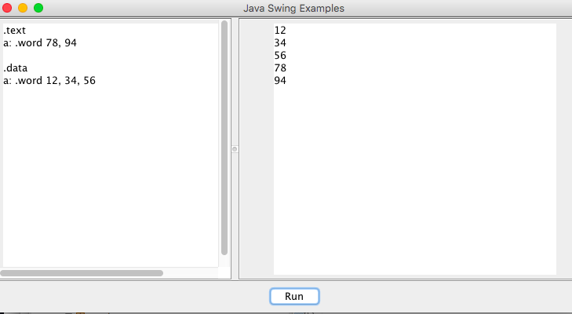

# plutoasm

Assembler is an important abstraction for the core of a microcontroller or microprocesor. Simulators such as [MARS MIPS](http://courses.missouristate.edu/kenvollmar/mars/) to learn how instructions operate on memory and digital logic. However, the instruction set of MARS is fixed. To help learning more on different kind of processors, the PLUTO simulator is an experiment.

In this first step, the Java Swing GUI combines a user interface with aa ANTLR parser. ANTLR provides a number of language grammars that can be interesting to develop an assembler, for example [ASM6502](https://github.com/antlr/grammars-v4/blob/master/asm6502/asm6502.g4)

# Example program

The first goal is to make this simple assembler program work that come as example on [CS61c](http://www-inst.eecs.berkeley.edu/~cs61c/fa10/labs/02a/):
     
             .data
     n:      .word 9
     
     
             .text
     main: 	add     $t0, $0, $zero
     	addi    $t1, $zero, 1
     	la      $t3, n
     	lw      $t3, 0($t3)
     fib: 	beq     $t3, $0, finish
     	add     $t2,$t1,$t0
     	move    $t0, $t1
     	move    $t1, $t2
     	subi    $t3, $t3, 1
     	j       fib
     finish: addi    $a0, $t0, 0
     	li      $v0, 1		# you will be asked about what the purpose of this line for syscall 
     	syscall			
     	li      $v0, 10		
     	syscall			
     
For this, the first step is to have a data structure (MemoryMap) that manages different segments of a memory. See [segments discussions](https://www.cs.umd.edu/class/sum2003/cmsc311/Notes/Mips/dataseg.html).

# Screenshot

# License

MIT, 2016, Patrick Mulder
